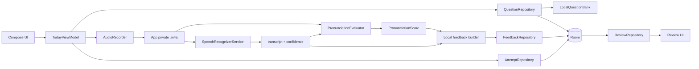

# 架构设计

## 1. 架构原则

- Compose 只负责渲染状态和上报事件，业务状态集中在 ViewModel。
- Domain 层保持纯 Kotlin，通过接口隔离 Room、DataStore、Retrofit、语音识别、TTS 和发音评测。
- 离线优先：本地原创题库和 Room 是默认可用路径，网络能力和云端能力必须可降级。
- Hilt 负责单例、Repository、音频和语音服务的装配。
- 所有外部服务都通过契约替换，不在 UI 中直接调用 SDK 或网络库。

## 2. 分层

```text
UI / Compose
    ↓ events
ViewModel / UiState
    ↓ repository / service contracts
Domain
    ↑ implementations
Data: Room / DataStore / Retrofit
Core: Audio / Speech / TTS / DI
```

## 3. 当前实现

- `QuestionRepository`：`OfflineFirstQuestionRepository` 首次启动写入原创本地题库，之后按日期、难度和话题稳定选题。
- `SettingsRepository`：`DataStoreSettingsRepository` 持久化每日题量、难度、口音、话题、提醒时间和 API Key 覆盖值。
- `AttemptRepository`：`RoomAttemptRepository` 保存录音记录和转写。
- `FeedbackRepository`：`RoomFeedbackRepository` 保存并读取反馈。
- `FavoriteRepository`：`RoomFavoriteRepository` 管理题目收藏。
- `ReviewRepository`：`RoomReviewRepository` 聚合每题最新 Attempt、Feedback 和收藏状态。
- `AudioRecorder`：`MediaRecorderAudioRecorder` 录制 AAC `.m4a`。
- `SpeechRecognizerService`：`SystemSpeechRecognizerService` 提供 Android 12+ 文件来源适配器，失败时抛出可恢复错误。
- `PronunciationEvaluator`：`DefaultPronunciationEvaluator` 使用识别置信度和 PCM 音频特征做粗略评分。
- `TtsService`：`AndroidTtsService` 按美音或英音朗读问题/参考回答。
- `DeepSeekService`：`DeepSeekServiceImpl` 已封装动态出题、翻译、参考回答、答案评价和改善建议请求，但尚未接入今日页和反馈页自动调用链。
- Hilt 模块：`DatabaseModule`、`RepositoryModule`、`SettingsModule`、`AudioModule`、`SpeechModule`、`NetworkModule`。
- 数据库当前使用 `fallbackToDestructiveMigration(dropAllTables = true)`；schema 已导出，正式发布前必须补 Migration。

## 4. 当前本地练习数据流



## 5. DeepSeek 服务边界

当前契约已经存在：

```kotlin
interface DeepSeekService {
    suspend fun generateDailyQuestions(
        date: String,
        count: Int,
        level: PracticeLevel,
        topics: List<String>,
    ): List<Question>

    suspend fun translateQuestion(question: Question): String

    suspend fun generateReferenceAnswers(
        question: Question,
        level: PracticeLevel,
    ): ReferenceAnswers

    suspend fun evaluateAnswer(
        question: Question,
        transcript: String,
        pronunciationScore: PronunciationScore,
    ): Feedback

    suspend fun improveAnswer(
        question: Question,
        transcript: String,
    ): ImprovementSuggestion
}
```

接入 Today/Feedback UI 时应遵循以下顺序：

1. 优先读取 Room 缓存和本地题库。
2. 只有用户主动启用云端 AI 并确认发送内容后，才调用 DeepSeek。
3. API Key 从 DataStore 覆盖值或 `BuildConfig` 读取，模型名从 `DEEPSEEK_MODEL` 读取。
4. 网络失败时保留本地 Attempt 和本地反馈，不清空用户数据。
5. 不把 `deepseek-v4.1-flash` 等未确认名称写入源码；必须以 DeepSeek 官方文档和真实联调结果为准。

## 6. 语音链路约束

Android `SpeechRecognizer` 的基础公开 API 不提供所有设备都可用的“直接输入任意音频文件”能力。当前实现：

- Android 12+ 使用 `RecognizerIntent.EXTRA_AUDIO_SOURCE`。
- Android 11 及以下明确返回不支持。
- 设备没有识别服务时返回明确错误。
- 识别失败不会生成假 transcript。

可选替代方案：

1. 让录音和实时识别共享一次会话，明确处理音频采集并发限制。
2. 接入支持音频文件的云识别适配器。
3. 接入本地离线识别引擎。
4. 通过 Hilt 替换 `SpeechRecognizerService` 实现。

## 7. 隐私与安全

- 录音存放到 `context.filesDir/recordings`，默认不上传。
- 云调用前显示数据发送说明并取得用户确认。
- `local.properties` 与 DataStore 中的 Key 均不得写入日志。
- 正式版应将 API Key 迁移到 Android Keystore 加密存储。
- 网络题库只保存授权内容或必要的摘要/链接，不保存侵权完整内容。
- 构建产物、本地 SDK、Gradle 缓存和 `local.properties` 不提交到 Git。