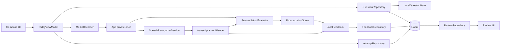
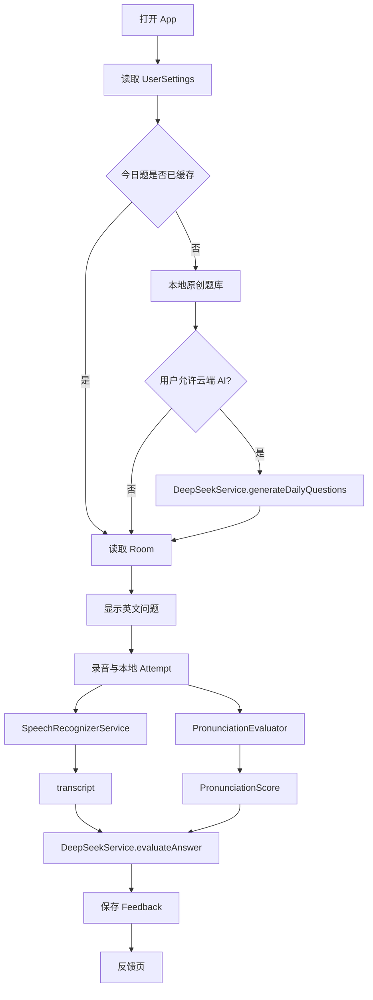

# 项目结构与数据流

## 1. 仓库结构

```text
Daily-Speak/
├── app/
│   ├── schemas/                              # Room schema 导出
│   └── src/
│       ├── main/
│       │   ├── AndroidManifest.xml
│       │   ├── java/com/thehan/dailyspeak/
│       │   │   ├── core/
│       │   │   │   ├── audio/                # AudioRecorder 与 MediaRecorder 实现
│       │   │   │   ├── di/                   # Hilt 模块
│       │   │   │   ├── reminder/             # AlarmManager 每日提醒与开机恢复
│       │   │   │   ├── speech/               # 系统识别、PCM 解码、粗发音评分
│       │   │   │   └── tts/                  # Android TextToSpeech 实现
│       │   │   ├── data/
│       │   │   │   ├── local/
│       │   │   │   │   ├── dao/              # Question/Attempt/Feedback/Favorite DAO
│       │   │   │   │   ├── entity/           # Room Entity
│       │   │   │   │   └── seed/             # 本地原创题库
│       │   │   │   ├── mapper/               # Entity 与 Domain 映射
│       │   │   │   ├── remote/deepseek/      # Retrofit DTO、API、Service
│       │   │   │   ├── repository/           # Repository 实现
│       │   │   │   └── settings/             # DataStore 设置持久化
│       │   │   ├── domain/
│       │   │   │   ├── model/                # 纯 Kotlin 领域模型
│       │   │   │   ├── repository/           # Repository 契约
│       │   │   │   └── service/              # DeepSeek/识别/评测/TTS 契约
│       │   │   ├── ui/
│       │   │   │   ├── feature/
│       │   │   │   │   ├── today/            # 今日练习与录音
│       │   │   │   │   ├── feedback/         # 反馈页
│       │   │   │   │   ├── review/           # 低分/收藏/历史复习
│       │   │   │   │   └── profile/          # 设置与 API Key
│       │   │   │   ├── navigation/
│       │   │   │   └── theme/
│       │   │   ├── DailySpeakApplication.kt
│       │   │   └── MainActivity.kt
│       │   └── res/
│       ├── test/                             # JVM 单元测试
│       │   └── java/com/thehan/dailyspeak/
│       │       ├── data/repository/          # 题库和复习仓库测试
│       │       └── ui/feature/review/        # 复习筛选状态测试
│       └── androidTest/                      # 预留 Compose UI 测试
├── gradle/
│   ├── libs.versions.toml
│   └── wrapper/
├── scripts/
│   └── build.ps1                              # 使用仓库外工具链构建与测试
├── dist/
│   └── Daily-Speak-v0.3.0.apk                 # 已签名的本机发布产物，Git 忽略
├── build.gradle.kts
├── settings.gradle.kts
├── local.properties.example
├── PRD.md
├── ARCHITECTURE.md
├── PROJECT_STRUCTURE.md
├── TASKS.md
├── RELEASE_NOTES_v0.1.0.md
├── RELEASE_NOTES_v0.2.0.md
├── RELEASE_NOTES_v0.3.0.md
└── README.md
```

仓库外工具链：

```text
..\.tooling/
├── android-sdk/
├── android-user-home/
├── gradle-user-home/
├── gradle-project-cache/
│   └── Daily-Speak/
├── kotlin-project-cache/
│   └── Daily-Speak/
├── jdk-24/
├── daily-speak-release.jks                    # 不进入 Git
└── daily-speak-release.properties             # 不进入 Git
```

`local.properties` 只保留本机 SDK 路径和本地 DeepSeek 配置，并由 `.gitignore` 忽略。

## 2. 模块职责

MVP 使用单 Android 模块，但包结构保持分层；后续需要时可拆成 `:core:*`、`:data`、`:domain` 和 `:feature:*`。

| 层 | 职责 | 主要类型 |
|---|---|---|
| UI | Compose 页面、导航、用户事件 | `TodayScreen`, `FeedbackScreen`, `ReviewScreen`, `ProfileScreen` |
| ViewModel | 页面状态、录音和分析编排 | `TodayViewModel`, `FeedbackViewModel`, `ReviewViewModel` |
| Domain | 纯 Kotlin 模型、Repository 和 Service 契约 | `Question`, `Attempt`, `Feedback`, `DeepSeekService` |
| Data | Room、DataStore、Retrofit、Repository 实现 | `DailySpeakDatabase`, `OfflineFirstQuestionRepository`, `DeepSeekServiceImpl` |
| Core | 音频、语音识别、发音评分、TTS、提醒、Hilt | `MediaRecorderAudioRecorder`, `SystemSpeechRecognizerService`, `DefaultPronunciationEvaluator`, `DailyReminderScheduler` |

## 3. 当前本地练习数据流



## 4. DeepSeek 数据流（用户确认后按需调用）



## 5. 关键接口

```kotlin
interface QuestionRepository {
    suspend fun getDailyQuestions(
        date: String,
        count: Int,
        level: PracticeLevel,
        topics: List<String>,
    ): List<Question>
}

interface PronunciationEvaluator {
    suspend fun evaluate(audioFile: File, expectedText: String): PronunciationScore
}

interface SpeechRecognizerService {
    suspend fun recognize(audioFile: File): String
}

interface TtsService {
    fun speak(text: String, accent: AccentPreference)
}
```

`SpeechRecognizerService.recognize(audioFile)` 的 Android 系统实现受平台和设备服务限制；当前使用 Android 13+ 文件来源路径，失败时明确报错，不生成假数据。
